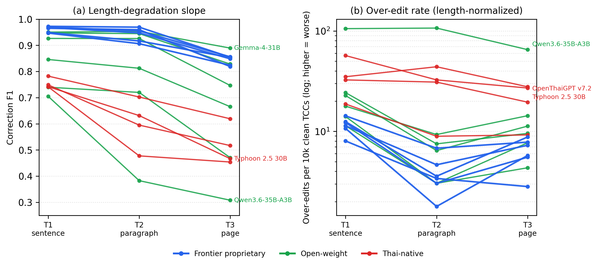

# ThaiEditBench: A Mechanism-Typed, Length-Stratified Benchmark for Thai Orthographic Error Correction

*ACL short paper (4-page body + uncounted Limitations/References/Appendix A–E).
Complete draft: Section 3–4 match exactly what we implemented; Section 5 carries **final post-audit
numbers for all three tiers** (T1 n=795 / T2 n=223 / T3 n=124, 16 models); Tables 1–2
+ Figure 1 are populated from the live run artifacts (`error_analysis.py`,
`viz/plot_degradation.py`, `viz/build_leaderboard.py`). Citations verified (see References);
cite keys match the BibTeX block. A LuaLaTeX/ACL build of this document lives in
`acl-paper/` (compile on Overleaf; see `acl-paper/README.md`).*

<!-- PROSE RULES (reviewer pass): no em-dashes; use "~" for numeric approximations (in LaTeX:
$\sim$); short sentences; acronyms GEC/CSC spelled out in the abstract, TCC/ERRANT at first body
use; NO Thai-script terms in the main body or body tables (worked examples and appendices may
keep Thai). Over-editing is reported as a length-normalized rate (per clean TCC), not a per-item
count. -->

---

## Abstract  *(~180 words)*

Thai is written without word boundaries and layers tone marks, silenced consonants, and heavy
loanword transliteration onto a Brahmic script. This produces orthographic error mechanisms
unlike those targeted by English **grammatical error correction (GEC)** or **Chinese spelling
check (CSC)**. We present **ThaiEditBench**, a character-level Thai orthographic
error-correction benchmark with three components: (i) a principled **six-class mechanism
taxonomy** plus an etymology tag; (ii) **three length tiers** (sentence, paragraph, and page)
that isolate robustness to long, mostly-clean context; and (iii) **contamination-robust
construction**, in which errors are *injected* into novel clean text and *mined* from Wikipedia
cleanup-bot history, then screened by a memorization probe. Because errors are introduced by
construction, gold corrections are exact and require no human annotation. Grading is at the
character-cluster level with span-based matching adapted from ERRANT. Evaluating **16 models**, we find that (1) on this benchmark, correction is
primarily a *detection* problem rather than a knowledge problem; (2) the evaluated
Thai-specialized models do not lead the strongest general models; and (3) long, mostly-correct
context exposes **over-edit accumulation** and clean-text fidelity failures that sentence-level
evaluation hides.

---

## 1. Introduction  *(~0.75 pg)*

Thai orthography is error-prone in script-specific ways: tone-mark selection and placement,
silenced-consonant marks, homophonous consonants, vowel-form confusions, consonant-cluster
metathesis, and inconsistent loanword transliteration. These are **character-level** errors
that turn on **specific mechanisms**, and Thai's lack of whitespace word boundaries makes them
hard to localize and score with token-based tools. Yet the resources to study them are missing.
Grammatical-error-correction benchmarks are English-centric
\citep{bryant-etal-2017-automatic,bryant-etal-2019-bea,napoles-etal-2017-jfleg}, and the
closest character-level analogue is Chinese spelling check
\citep{tseng-etal-2015-introduction,liu-etal-2011-visually}. For Thai, existing
error-annotated resources are social-media, informal, or learner-domain
\citep{lertpiya-etal-2020-thai,nakwijit-purver-2022-misspelling}, and there is no
formal-register, mechanism-typed, contamination-controlled orthographic benchmark.
Document-level and context-aware GEC study correction over long context
\citep{yuan-bryant-2021-document}, but no benchmark isolates length and error-sparsity
robustness for Thai orthographic correction.

**Contributions.**
1. **ThaiEditBench**: a character-level Thai orthographic correction benchmark with a six-class
   mechanism taxonomy plus an etymology tag, **three length tiers** (sentence, paragraph, page),
   built **contamination-robust by construction** (confusion-set injection over novel clean
   text and Wikipedia cleanup-bot mining, memorization-probe screened) so gold is exact and
   needs no human annotation.
2. An **ERRANT-style orthographic edit-typer for Thai** that aligns edits at TCC level and
   labels each with one of the six mechanism classes, enabling **per-mechanism span-F0.5**
   (cf. ChERRANT's dual-granularity scoring \citep{zhang-etal-2022-mucgec}). We use it as a
   scoring and diagnosis instrument, not a general Thai grammatical error classifier.
3. A **16-model evaluation** yielding three findings: correction-is-detection, the evaluated
   Thai-specialized systems do not lead, and over-edit accumulation under long context in weaker
   models.

We release code, data, grader, edit-typer, and the variant map, anonymized for review:
<https://github.com/BlindReviewYN/ThaiEditingBench>.

---

## 2. Related Work  *(~0.3 pg, compressed)*

**GEC and CSC.** English grammatical error correction is evaluated with span-based metrics.
The M² scorer matches a system's edits against gold edit spans \citep{dahlmeier-ng-2012-better};
ERRANT (the ERRor ANnotation Toolkit) additionally infers an error type for each edit
automatically and reports an F0.5 score \citep{bryant-etal-2017-automatic}; and GLEU measures
fluency \citep{napoles-etal-2015-ground}.
ERRANT-style span matching aligns the wrong and corrected text into a minimal set of edit
spans, then credits a system for each gold span it recovers with the correct replacement; we
adapt this scheme to Thai TCC units (Section 4.2). Character-level Chinese spelling check is the
closest task, scoring position-based detection and correction F1 without word boundaries
\citep{tseng-etal-2015-introduction,wu-etal-2013-chinese,yu-etal-2014-overview}, with
confusion-set construction \citep{liu-etal-2011-visually} and the MuCGEC/ChERRANT
dual-granularity scorer \citep{zhang-etal-2022-mucgec}. ERRANT has been ported to Arabic
\citep{belkebir-habash-2021-automatic} and Korean \citep{yoon-etal-2023-towards}, but not Thai.
Wikipedia-revision mining of typo pairs is established for English
\citep{grundkiewicz-junczysdowmunt-2014-wiked} and Japanese \citep{tanaka-etal-2020-building}.

**Thai NLP.** We build on PyThaiNLP for tokenization and dictionary tooling
\citep{phatthiyaphaibun-etal-2023-pythainlp} and on the Thai Character Cluster as the minimal
orthographic unit \citep{theeramunkong-etal-2000-character}. Prior Thai spelling correction
targets social text \citep{lertpiya-etal-2020-thai,lertpiya-etal-2023-progressively}, and
related work studies the semantics of Thai misspellings \citep{nakwijit-purver-2022-misspelling}.
The VISTEC-TP-TH-2021 Twitter corpus includes misspelling detection and correction as well as
word-segmentation annotation, but it is informal Twitter text rather than a formal-register,
mechanism-typed orthographic benchmark \citep{limkonchotiwat-etal-2021-handling}.

---

## 3. The ThaiEditBench Benchmark  *(~1.4 pg; write concretely; this is what we built)*

### 3.1 Task
Given a Thai passage containing character-level orthographic errors, return the passage with
those errors corrected and **nothing else changed**: no rewriting, re-spacing, numeral, or
punctuation edits. We score under a strict **minimal-edit contract**, where any change to a
non-erroneous span is an *over-edit* and is penalized.

### 3.2 Mechanism taxonomy
We define six orthographic mechanism classes, each carrying an **etymology tag**: tone mark,
consonant-pair, silent-consonant, vowel, cluster or metathesis, and loanword transliteration.
Worked examples per class are in Appendix A. Canonical forms are verified against the Royal
Institute Dictionary (ORST). Class 6 is governed by a **loanword-absorption rule**: only
*contemporary* foreign loans are class 6, while long-integrated borrowings (Tamil, Khmer,
Persian, and Sanskrit–Pali doublets) are treated as native.

### 3.3 Construction
Two complementary sources both yield **construction-gold**. Applying the gold edits to an item
restores the clean original, which we verified holds for 100% of items.
- **(a) Confusion-set injection.** A 1,044-pair × 6-class Thai confusion set is injected into
  *novel clean text* using **whole-token-run matching** (not substring) to protect short valid
  forms. Each injected item records the Thai Character Cluster (TCC) span, class, and etymology.
- **(b) Cleanup-bot mining.** Real wrong→correct pairs are mined from the edit history of a Thai
  Wikipedia spelling-cleanup bot (RID-gated and misalignment-guarded), following the
  revision-mining tradition \citep{tanaka-etal-2020-building,grundkiewicz-junczysdowmunt-2014-wiked}.

**Registers.** The clean text spans news (thaisum), encyclopedic (Thai Wikipedia), and
government and legal (Royal Gazette, thaigov), all permissively redistributable.

### 3.4 Contamination control
The benchmark reduces contamination risk by evaluating systems on **corrupted passages that do
not appear verbatim in the source corpora**. A residual risk remains: a model that memorized a
clean source passage could reconstruct it directly instead of detecting and correcting the
injected errors. We therefore run a **verbatim-continuation memorization probe** on the source
passages and hold the lowest-memorization material out from the public release.

### 3.5 Length tiers
The same pipeline produces three tiers that vary passage length and error sparsity. **T1**
(sentence) has 795 items of ~100 characters each; **T2** (paragraph) has 223 items of
~424 characters; and **T3** (page) has 124 items of ~1,242 characters. Item counts
are class-balanced across the six mechanisms, and full per-tier statistics are in Appendix C.
The error budget is **dense at the sentence level**, with roughly one error per 100 characters,
and deliberately **sparse at paragraph and page length**, where most sentences are clean
distractors. T2 and T3 therefore measure **precision under long correct context** (over-editing),
not just recall, an axis the CSC and GEC literature does not test.

### 3.6 Quality control (fully automatic)
Because errors are introduced by construction, the gold is exact. We add two automatic guards.
- **Cross-model consensus audit.** When at least k=3 of the 16 systems produce the *same*
  normalized output that differs from gold, we flag the item for review. Consensus is a flagging
  heuristic, not proof of a gold defect. We drop the item only when the agreed output is a
  residual *source* typo that the construction-time filter missed. We keep the other two cases:
  a *shared miss*, where the consensus equals the corrupted input and the gold is fine, and a
  *systematic over-edit* on punctuation or register. The classification is deterministic. The
  audit removed 24 of 819 (T1), 27 of 250 (T2), and 26 of 150 (T3) items, and post-audit no item
  is universally missed. The full protocol is in Appendix B.
- **Variant reconciliation.** Spellings with two accepted forms are reconciled to the gold form
  before scoring, token-aware and compound-safe. This covers orthographic doublets, loanword
  transliterations, and an informal-to-formal pronoun pair, so a model is never penalized for a
  legitimate variant.

Orthographic correction is essentially **single-reference**, since there is one correct
spelling, so we do not adopt multi-reference GEC machinery. Variant reconciliation covers the
few genuine alternatives.

---

## 4. Evaluation Protocol  *(~0.5 pg)*

### 4.1 Metrics
We grade at the TCC level \citep{theeramunkong-etal-2000-character} with ERRANT-style span
matching \citep{bryant-etal-2017-automatic}. The **primary metric is correction F1**: minimal
TCC edits are derived by aligning the wrong text against *both* the gold and the system output
under the **same** Levenshtein alignment, so an output identical to the reference scores exactly
1.0 (SIGHAN-CSC-comparable \citep{tseng-etal-2015-introduction}), and we report it with a 95%
**item-bootstrap confidence interval**. **Detection F1** credits the correct error site and
ignores the replacement. **Clean-sentence fidelity** is the fraction of error-free sentences
left untouched, the exact and construction-grounded precision signal for T2 and T3. We also
report **per-mechanism span-F0.5** via the edit-typer (Section 4.2). Word-level GLEU is reported only
as a supplementary metric in Appendix D, because Thai word segmentation is unreliable for this
task.

### 4.2 ERRANT-style edit-typer
We adapt the ERRANT/ChERRANT design \citep{bryant-etal-2017-automatic,zhang-etal-2022-mucgec}
to Thai orthography. For a (wrong, correct) pair: extract edit spans at **TCC level** (the same
alignment the grader uses), expand each to its enclosing word (PyThaiNLP `newmm`
\citep{phatthiyaphaibun-etal-2023-pythainlp}), and label it with one of the six mechanism
classes (plus an edit-operation tag); class 6 is etymology-gated by a loan lexicon. This enables
**per-mechanism span-F0.5**. Its inventory is orthographic-mechanism-specific and reuses the
construction-time classifier, so we treat it as a **scoring instrument**, not a general Thai
grammatical error classifier.

### 4.3 Models & inference
We evaluate 16 models, each in a single fixed configuration, at temperature 0 where supported,
with one fixed Thai instruction prompt. The **frontier proprietary** models are GPT-5.5 (medium
and high reasoning), Gemini 3.5 Flash, Claude Opus 4.7 (non-thinking), Claude Sonnet 4.6
(non-thinking), and GPT-5.4-mini. The **open-weight** models are Gemma-4-31B, DeepSeek V4 Pro
and Flash, GLM-5.1, MiniMax-M2.7, and Qwen3.6-35B-A3B. The **Thai-native** models are Typhoon
2.5 (30B) and three ThaiLLM 8B-instruct models served through the national ThaiLLM gateway,
namely OpenThaiGPT, Typhoon-S, and THaLLE \citep{pipatanakul-etal-2024-typhoon2,pipatanakul-etal-2026-typhoons}.

---

## 5. Results & Analysis  *(~1.0 pg)*

### 5.1 Leaderboard
The full leaderboard is Table 2 (Appendix D), reporting correction F1 across the three tiers
(post-audit: n = 795 / 223 / 124). The frontier clusters at 0.95 to 0.97 on T1, and bootstrap CIs separate three strata (frontier,
then GLM, then the Thai-8B models and runaways). No single model solves the entire T1 set, and
no item is *missed* by every model, so the gold is clean post-audit yet retains per-model hard
cases. **The benchmark discriminates**, and the length-degradation slope (T1 to T3) is the
sharpest discriminator (Section 5.3).

General frontier models dominate, while Thai-specialized models trail. Typhoon 2.5 scores 0.742
on T1 and 0.467 on T3, and the 8B national-gateway models score 0.74 to 0.78 on T1 but fall to
0.45 to 0.62 on T3. The strongest **open-weight** model is a general 31B model, Gemma-4. It is
within CI of the frontier proprietary models on T1 and T2 and is the single best model on the
page tier (T3, 0.889). Under this setup the evaluated Thai-specialized systems do not lead, and
the gap widens with length. This comparison is confounded by differences in model scale, serving
stack, and inference configuration, so it is not evidence about Thai-specialized pretraining in
general.

### 5.2 Correction is a *detection* problem, not a *knowledge* problem
Decompose every gold edit (T1) into **fixed**, **wrong_corr** (right site, wrong fix), and
**missed** (Table 1). Across **all 16 models**, `wrong_corr` never exceeds 0.036, while `missed`
carries essentially the entire error budget. Once a model *notices* an error it almost always
fixes it correctly. What separates models is **error discrimination**, not knowledge of correct
spellings. This reframes the implicit assumption in correction-centric CSC work.

| model | fixed | wrong_corr | missed |
|---|--:|--:|--:|
| GPT-5.5 (high) | 0.993 | 0.000 | 0.007 |
| Gemma-4-31B | 0.956 | 0.004 | 0.040 |
| Qwen3.6-35B-A3B | 0.817 | 0.018 | 0.165 |
| Typhoon 2.5 30B | 0.764 | 0.036 | 0.201 |

**Table 1: Gold-edit outcome decomposition (T1).** `wrong_corr` stays near zero for every model;
the budget is `missed`.

### 5.3 Length robustness
Sentence-tier rank does **not** predict paragraph or page behaviour, and the **degradation slope
from T1 to T3 is the sharpest discriminator** (Figure 1a). The frontier loses only 0.10 to 0.12
correction F1 (GPT-5.5-med 0.969→0.856; Gemma-4 0.950→0.889), while weak models fall off a cliff
(Typhoon 2.5 0.742→0.467; Qwen 0.705→**0.308**, a drop of 0.40).

The long tiers also expose over-editing. We measure it as the over-edit rate per 10,000 clean
TCCs, which factors out how much clean text a model is exposed to. This rate is roughly flat or
falls across tiers (Qwen 105→107→65; Typhoon 2.5 57→33→27; Figure 1b), so over-editing
accumulates with length through exposure rather than through a rising false-positive rate. The
discriminating signal is the *level* of that rate, not its slope: weak models over-edit at 5 to
20 times the frontier's per-unit rate, which stays below ~15 per 10,000 clean TCCs at every
tier. Clean-sentence **fidelity** tells the same story. The frontier holds at or above 0.95
throughout, while weak models sit at 0.78 to 0.90 regardless of length. **Over-editing and
missing are two faces of the same weak discrimination**: a model that cannot tell correct from
incorrect both misses real errors and rewrites correct text. The exception is instructive.
**Gemini 3.5 Flash keeps high recall at T3, fixing 0.985 of gold edits, yet drops to 0.819
correction F1 purely on precision**. It is the one frontier model whose page-tier score is
limited by over-editing rather than by detection.

### 5.4 Per-mechanism difficulty
Class 6 (loanword) is the hardest mechanism, with ~0.81 of edits fixed versus ~0.86
to 0.90 for tone marks, consonant pairs, and silent-consonant marks. The failure is again
**missed**, not miscorrected: models are least certain that a transliteration is wrong. But the
*ranking* within class 6 does **not** favour Thai-native models. Difficulty is a property of the
**mechanism**, not of cross-lingual knowledge. Register agrees: loanword-dense encyclopedic text
is hardest (recall ~0.71 to 0.82) versus government and news text (~0.83 to 0.90).

---

## 6. Conclusion  *(~0.15 pg)*
ThaiEditBench is a mechanism-typed, length-stratified, contamination-robust benchmark for Thai
orthographic correction, released with an ERRANT-style edit-typer for per-mechanism scoring.
Across 16 models it reframes correction as a **detection** problem, shows that the evaluated
**Thai-specialized systems do not lead**, and surfaces **over-edit accumulation** under long
context in weaker models.

---

## Limitations  *(uncounted; leads with error density per design)*
- **Sparse error density (primary).** The long tiers (T2 and T3) are deliberately sparse, with
  1 to 3 errors scattered across otherwise-clean passages, to isolate precision under long
  correct context. We therefore do **not** test **high error-density** regimes such as
  heavy-typo input, degraded OCR, or L2 writing, where errors co-occur, interact, mask one
  another, and correction order matters. Extending ThaiEditBench to dense multi-error passages,
  and testing whether the detection-not-knowledge result survives when errors crowd each other,
  is the most important next step.
- **Reasoning-mode not swept.** Models run in mixed default configurations, so the leaderboard
  compares default behaviour rather than a controlled thinking-on or thinking-off contrast.
- **Configured-system comparison.** Each system is evaluated under one fixed configuration.
  Reasoning modes, token budgets, provider defaults, serving stacks, and model scale are not
  controlled, so the leaderboard reflects configured-system behaviour rather than an intrinsic
  ranking of base-model capability.
- **Length-normalized over-editing.** Raw over-edits per item rise with passage length, because
  longer passages expose more clean text where a false positive can occur. We therefore report
  the over-edit rate per clean TCC alongside the absolute per-passage count, and we base rate
  claims on the normalized metric while reading the absolute count as user-visible accumulation.
- **Minimal-edit vs fluency boundary.** Occasionally a frontier "over-edit" is actually catching
  a residual error that our injection-gold did not mark, which slightly understates the best
  models.
- **No human inter-annotator agreement.** Gold is construction-based, either injected or mined,
  and audited automatically. We run no human annotation pass, so no inter-annotator agreement is
  reported. This is sound for *injected* errors, where the gold is exact by construction, but the
  mechanism-class labels and the mined items rest on automatic typing rather than on measured
  human consensus.

---

## References (verified)

<!-- All entries verified against ACL Anthology / DOI / dblp by a citation-checking pass.
Corrections applied vs first-draft memory: SIGHAN-2014 = Yu/Lee/Tseng/Chen (no "Chang");
KAGAS = ACL 2023 (not EACL); Nakwijit&Purver title = "Misspelling Semantics in Thai";
TCC authors = Theeramunkong/Sornlertlamvanich/Tanhermhong/Chinnan; Liu-2011 full subtitle;
CSCD-IME = arXiv:2211.08788 v1 (live page now retitled CSCD-NS).
Added 2026-05-26, verified vs arXiv / ACL Anthology: Typhoon 2 = arXiv:2412.13702 (Pipatanakul
et al. 2024); OpenThaiGPT 1.5 = arXiv:2411.07238 (Yuenyong et al. 2024); Typhoon-S =
arXiv:2601.18129 (Pipatanakul and Taveekitworachai 2026); doc-level GEC = Yuan and Bryant, BEA
2021, aclanthology 2021.bea-1.8, pp. 75--84. -->

```bibtex
@inproceedings{bryant-etal-2017-automatic,
    title = "Automatic Annotation and Evaluation of Error Types for Grammatical Error Correction",
    author = "Bryant, Christopher and Felice, Mariano and Briscoe, Ted",
    booktitle = "Proceedings of the 55th Annual Meeting of the Association for Computational Linguistics (Volume 1: Long Papers)",
    month = jul, year = "2017", address = "Vancouver, Canada",
    publisher = "Association for Computational Linguistics",
    url = "https://aclanthology.org/P17-1074/", doi = "10.18653/v1/P17-1074", pages = "793--805"
}

@inproceedings{bryant-etal-2019-bea,
    title = "The {BEA}-2019 Shared Task on Grammatical Error Correction",
    author = "Bryant, Christopher and Felice, Mariano and Andersen, {\O}istein E. and Briscoe, Ted",
    booktitle = "Proceedings of the Fourteenth Workshop on Innovative Use of NLP for Building Educational Applications",
    month = aug, year = "2019", address = "Florence, Italy",
    publisher = "Association for Computational Linguistics",
    url = "https://aclanthology.org/W19-4406/", doi = "10.18653/v1/W19-4406", pages = "52--75"
}

@inproceedings{zhang-etal-2022-mucgec,
    title = "{M}u{CGEC}: a Multi-Reference Multi-Source Evaluation Dataset for {C}hinese Grammatical Error Correction",
    author = "Zhang, Yue and Li, Zhenghua and Bao, Zuyi and Li, Jiacheng and Zhang, Bo and Li, Chen and Huang, Fei and Zhang, Min",
    booktitle = "Proceedings of the 2022 Conference of the North American Chapter of the Association for Computational Linguistics: Human Language Technologies",
    month = jul, year = "2022", address = "Seattle, United States",
    publisher = "Association for Computational Linguistics",
    url = "https://aclanthology.org/2022.naacl-main.227/", doi = "10.18653/v1/2022.naacl-main.227", pages = "3118--3130"
}

@inproceedings{napoles-etal-2015-ground,
    title = "Ground Truth for Grammatical Error Correction Metrics",
    author = "Napoles, Courtney and Sakaguchi, Keisuke and Post, Matt and Tetreault, Joel",
    booktitle = "Proceedings of the 53rd Annual Meeting of the Association for Computational Linguistics and the 7th International Joint Conference on Natural Language Processing (Volume 2: Short Papers)",
    month = jul, year = "2015", address = "Beijing, China",
    publisher = "Association for Computational Linguistics",
    url = "https://aclanthology.org/P15-2097/", doi = "10.3115/v1/P15-2097", pages = "588--593"
}

@inproceedings{napoles-etal-2017-jfleg,
    title = "{JFLEG}: A Fluency Corpus and Benchmark for Grammatical Error Correction",
    author = "Napoles, Courtney and Sakaguchi, Keisuke and Tetreault, Joel",
    booktitle = "Proceedings of the 15th Conference of the {E}uropean Chapter of the Association for Computational Linguistics: Volume 2, Short Papers",
    month = apr, year = "2017", address = "Valencia, Spain",
    publisher = "Association for Computational Linguistics",
    url = "https://aclanthology.org/E17-2037/", pages = "229--234"
}

@inproceedings{dahlmeier-ng-2012-better,
    title = "Better Evaluation for Grammatical Error Correction",
    author = "Dahlmeier, Daniel and Ng, Hwee Tou",
    booktitle = "Proceedings of the 2012 Conference of the North {A}merican Chapter of the Association for Computational Linguistics: Human Language Technologies",
    month = jun, year = "2012", address = "Montr{\'e}al, Canada",
    publisher = "Association for Computational Linguistics",
    url = "https://aclanthology.org/N12-1067/", pages = "568--572"
}

@inproceedings{tseng-etal-2015-introduction,
    title = "Introduction to {SIGHAN} 2015 Bake-off for {C}hinese Spelling Check",
    author = "Tseng, Yuen-Hsien and Lee, Lung-Hao and Chang, Li-Ping and Chen, Hsin-Hsi",
    booktitle = "Proceedings of the Eighth {SIGHAN} Workshop on {C}hinese Language Processing",
    month = jul, year = "2015", address = "Beijing, China",
    publisher = "Association for Computational Linguistics",
    url = "https://aclanthology.org/W15-3106/", doi = "10.18653/v1/W15-3106", pages = "32--37"
}

@inproceedings{wu-etal-2013-chinese,
    title = "{C}hinese Spelling Check Evaluation at {SIGHAN} Bake-off 2013",
    author = "Wu, Shih-Hung and Liu, Chao-Lin and Lee, Lung-Hao",
    booktitle = "Proceedings of the Seventh {SIGHAN} Workshop on {C}hinese Language Processing",
    month = oct, year = "2013", address = "Nagoya, Japan",
    publisher = "Asian Federation of Natural Language Processing",
    url = "https://aclanthology.org/W13-4406/", pages = "35--42"
}

@article{liu-etal-2011-visually,
    title = "Visually and Phonologically Similar Characters in Incorrect {C}hinese Words: Analyses, Identification, and Applications",
    author = "Liu, Chao-Lin and Lai, Min-Hua and Tien, Kan-Wen and Chuang, Yi-Hsuan and Wu, Shih-Hung and Lee, Chia-Ying",
    journal = "ACM Transactions on Asian Language Information Processing",
    year = "2011", volume = "10", number = "2", articleno = "10", pages = "10:1--10:39",
    publisher = "Association for Computing Machinery", doi = "10.1145/1967293.1967297"
}

@misc{hu-etal-2022-cscd,
    title = "{CSCD-IME}: Correcting Spelling Errors Generated by Pinyin {IME}",
    author = "Hu, Yong and Meng, Fandong and Zhou, Jie",
    year = "2022",
    note = "arXiv:2211.08788v1; the same submission was later retitled CSCD-NS: a Chinese Spelling Check Dataset for Native Speakers",
    url = "https://arxiv.org/abs/2211.08788v1", eprint = "2211.08788", archivePrefix = "arXiv"
}

@inproceedings{theeramunkong-etal-2000-character,
    title = "Character cluster based {T}hai information retrieval",
    author = "Theeramunkong, Thanaruk and Sornlertlamvanich, Virach and Tanhermhong, Thanasan and Chinnan, Wirat",
    booktitle = "Proceedings of the Fifth International Workshop on Information Retrieval with Asian Languages (IRAL 2000)",
    year = "2000", address = "Hong Kong, China",
    publisher = "Association for Computing Machinery", pages = "75--80", doi = "10.1145/355214.355225"
}

@inproceedings{tanaka-etal-2020-building,
    title = "Building a {J}apanese Typo Dataset from {W}ikipedia{'}s Revision History",
    author = "Tanaka, Yu and Murawaki, Yugo and Kawahara, Daisuke and Kurohashi, Sadao",
    booktitle = "Proceedings of the 58th Annual Meeting of the Association for Computational Linguistics: Student Research Workshop",
    month = jul, year = "2020", address = "Online",
    publisher = "Association for Computational Linguistics",
    url = "https://aclanthology.org/2020.acl-srw.31/", doi = "10.18653/v1/2020.acl-srw.31", pages = "230--236"
}

@incollection{grundkiewicz-junczysdowmunt-2014-wiked,
    title = "The {WikEd} Error Corpus: A Corpus of Corrective {W}ikipedia Edits and Its Application to Grammatical Error Correction",
    author = "Grundkiewicz, Roman and Junczys-Dowmunt, Marcin",
    booktitle = "Advances in Natural Language Processing -- Lecture Notes in Computer Science, Vol. 8686 (PolTAL 2014)",
    editor = "Przepi{\'o}rkowski, Adam and Ogrodniczuk, Maciej",
    year = "2014", publisher = "Springer", pages = "478--490", doi = "10.1007/978-3-319-10888-9_47"
}

@inproceedings{limkonchotiwat-etal-2021-handling,
    title = "Handling Cross- and Out-of-Domain Samples in {T}hai Word Segmentation",
    author = "Limkonchotiwat, Peerat and Phatthiyaphaibun, Wannaphong and Sarwar, Raheem and Chuangsuwanich, Ekapol and Nutanong, Sarana",
    booktitle = "Findings of the Association for Computational Linguistics: ACL-IJCNLP 2021",
    month = aug, year = "2021", address = "Online",
    publisher = "Association for Computational Linguistics",
    url = "https://aclanthology.org/2021.findings-acl.86/", doi = "10.18653/v1/2021.findings-acl.86", pages = "1003--1016"
}

@inproceedings{nakwijit-purver-2022-misspelling,
    title = "Misspelling Semantics in {T}hai",
    author = "Nakwijit, Pakawat and Purver, Matthew",
    booktitle = "Proceedings of the Thirteenth Language Resources and Evaluation Conference",
    month = jun, year = "2022", address = "Marseille, France",
    publisher = "European Language Resources Association",
    url = "https://aclanthology.org/2022.lrec-1.24/", pages = "227--236"
}

@inproceedings{phatthiyaphaibun-etal-2023-pythainlp,
    title = "{P}y{T}hai{NLP}: {T}hai Natural Language Processing in Python",
    author = "Phatthiyaphaibun, Wannaphong and Chaovavanich, Korakot and Polpanumas, Charin and Suriyawongkul, Arthit and Lowphansirikul, Lalita and Chormai, Pattarawat and Limkonchotiwat, Peerat and Suntorntip, Thanathip and Udomcharoenchaikit, Can",
    booktitle = "Proceedings of the 3rd Workshop for Natural Language Processing Open Source Software (NLP-OSS 2023)",
    month = dec, year = "2023", address = "Singapore",
    publisher = "Association for Computational Linguistics",
    url = "https://aclanthology.org/2023.nlposs-1.4/", doi = "10.18653/v1/2023.nlposs-1.4", pages = "25--36"
}

@inproceedings{belkebir-habash-2021-automatic,
    title = "Automatic Error Type Annotation for {A}rabic",
    author = "Belkebir, Riadh and Habash, Nizar",
    booktitle = "Proceedings of the 25th Conference on Computational Natural Language Learning",
    month = nov, year = "2021", address = "Online",
    publisher = "Association for Computational Linguistics",
    url = "https://aclanthology.org/2021.conll-1.47/", doi = "10.18653/v1/2021.conll-1.47", pages = "596--606"
}

@inproceedings{yoon-etal-2023-towards,
    title = "Towards standardizing {K}orean Grammatical Error Correction: Datasets and Annotation",
    author = "Yoon, Soyoung and Park, Sungjoon and Kim, Gyuwan and Cho, Junhee and Park, Kihyo and Kim, Gyu Tae and Seo, Minjoon and Oh, Alice",
    booktitle = "Proceedings of the 61st Annual Meeting of the Association for Computational Linguistics (Volume 1: Long Papers)",
    month = jul, year = "2023", address = "Toronto, Canada",
    publisher = "Association for Computational Linguistics",
    url = "https://aclanthology.org/2023.acl-long.371/", doi = "10.18653/v1/2023.acl-long.371", pages = "6713--6742"
}

@article{lertpiya-etal-2020-thai,
    title = "Thai Spelling Correction and Word Normalization on Social Text Using a Two-Stage Pipeline With Neural Contextual Attention",
    author = "Lertpiya, Anuruth and Chalothorn, Tawunrat and Chuangsuwanich, Ekapol",
    journal = "IEEE Access", year = "2020", volume = "8", pages = "133403--133419",
    publisher = "IEEE", doi = "10.1109/ACCESS.2020.3010828"
}

@article{lertpiya-etal-2023-progressively,
    title = "How to Progressively Build {T}hai Spelling Correction Systems?",
    author = "Lertpiya, Anuruth and Chalothorn, Tawunrat and Buabthong, Pakpoom",
    journal = "IEEE Access", year = "2023", volume = "11", pages = "72704--72716",
    publisher = "IEEE", doi = "10.1109/ACCESS.2023.3295004"
}

@inproceedings{yu-etal-2014-overview,
    title = "Overview of {SIGHAN} 2014 Bake-off for {C}hinese Spelling Check",
    author = "Yu, Liang-Chih and Lee, Lung-Hao and Tseng, Yuen-Hsien and Chen, Hsin-Hsi",
    booktitle = "Proceedings of the Third {CIPS}-{SIGHAN} Joint Conference on {C}hinese Language Processing",
    month = oct, year = "2014", address = "Wuhan, China",
    publisher = "Association for Computational Linguistics",
    url = "https://aclanthology.org/W14-6820/", doi = "10.3115/v1/W14-6820", pages = "126--132"
}

@misc{pipatanakul-etal-2024-typhoon2,
    title = "{T}yphoon 2: A Family of Open Text and Multimodal {T}hai Large Language Models",
    author = "Pipatanakul, Kunat and Manakul, Potsawee and Nitarach, Natapong and Sirichotedumrong, Warit and Nonesung, Surapon and Jaknamon, Teetouch and Pengpun, Parinthapat and Taveekitworachai, Pittawat and Na-Thalang, Adisai and Sripaisarnmongkol, Sittipong and Jirayoot, Krisanapong and Tharnpipitchai, Kasima",
    year = "2024",
    url = "https://arxiv.org/abs/2412.13702", eprint = "2412.13702", archivePrefix = "arXiv"
}

@misc{pipatanakul-etal-2026-typhoons,
    title = "{T}yphoon-{S}: Minimal Open Post-Training for Sovereign Large Language Models",
    author = "Pipatanakul, Kunat and Taveekitworachai, Pittawat",
    year = "2026",
    url = "https://arxiv.org/abs/2601.18129", eprint = "2601.18129", archivePrefix = "arXiv"
}

@inproceedings{yuan-bryant-2021-document,
    title = "Document-level grammatical error correction",
    author = "Yuan, Zheng and Bryant, Christopher",
    booktitle = "Proceedings of the 16th Workshop on Innovative Use of NLP for Building Educational Applications",
    month = apr, year = "2021", address = "Online",
    publisher = "Association for Computational Linguistics",
    url = "https://aclanthology.org/2021.bea-1.8/", pages = "75--84"
}
```

---

## Appendix A: Mechanism taxonomy in detail

Each class is defined by the orthographic *mechanism* of the fault, not its surface character,
so a single character (the silencing mark ◌์) participates in more than one class depending on
the operation. Multiple worked examples per class:

| class | mechanism | examples (wrong → correct) |
|---|---|---|
| 1 | tone mark | ค๊ะ → คะ · น๊ะ → นะ · จั๊กจั่น → จักจั่น · กระทั้ง → กระทั่ง |
| 2 | consonant-pair | กฏหมาย → กฎหมาย · กบฎ → กบฏ · อากาส → อากาศ · กรกฏาคม → กรกฎาคม |
| 3 | silent-consonant | กลยุทธ → กลยุทธ์ · ขาดดุลย์ → ขาดดุล · เท่ห์ → เท่ |
| 4 | vowel | สังเกตุ → สังเกต · มาตราฐาน → มาตรฐาน · ฉะเพาะ → เฉพาะ |
| 5 | cluster / metathesis | กระทันหัน → กะทันหัน · กระบังลม → กะบังลม · ฆรา → ฆาร |
| 6 | loanword translit. | กราฟฟิค → กราฟิก · กงศุล → กงสุล · กอลฟ์ → กอล์ฟ · ลิ๊งค์ → ลิงก์ |

**Loanword-absorption rule (class 6 vs native).** Only *contemporary* foreign loans, chiefly
modern English technical and commercial terms (กราฟิก *graphic*, ดิจิทัล *digital*, ลิงก์
*link*), are class 6. Long-integrated borrowings are treated as **native** even though
etymologically foreign: Portuguese (กะละแม), Burmese (กะปิ), Mon (กะพง), Khmer (กบฏ), and Tamil,
Persian, and Sanskrit–Pali doublets. Borderline cases (e.g. กงสุล *consul*, established but
foreign) are resolved by ORST listing + Wiktionary borrowed-term categories. The tag is recorded
per item so the rule is auditable and the class-6 results can be recomputed under a different
cut-off.

## Appendix B: Gold quality control & the consensus audit

**Why construction-gold still needs a cleanup pass.** Injection guarantees that applying the
gold edits recovers the clean original (verified 100%), so the *injected* error's correction is
exact. It does **not** guarantee that the **source passage was itself typo-free**: the permissive
corpora (thaisum, Thai Wikipedia, Royal Gazette, thaigov) contain a small rate of residual
orthographic errors. When an item's clean source text carries such a residual typo, the gold
`text_correct` inherits it, so a model that fixes *that* genuinely wrong span is unfairly scored
as a miss or an over-edit. We remove these automatically, consistent with the by-construction
design.

**Cross-model consensus audit.** For every item we pool all 16 model outputs (variant-reconciled,
Section 3.6) and look for a *consensus* output, the same normalized string produced by at least k=3
systems, that differs from the gold. The discrimination is three-way:

| consensus output equals… | interpretation | action |
|---|---|---|
| the corrupted input `text_wrong` | **shared miss**: models all left the injected error; gold is correct | **keep** |
| a punctuation/whitespace/register variant of gold | systematic **over-edit** (the precision signal we want to measure) | **keep** |
| a *different* spelling fix at an unmarked span | **residual source typo** the gold inherited | **drop** |

Only the third case is a gold defect. Conflating it with shared misses (which look superficially
similar, since the consensus is not the gold) would over-prune. The explicit `consensus =
text_wrong` test prevents this. The audit removed **24 of 819 (T1), 27 of 250 (T2), and 26 of
150 (T3)** items, for example ทั้งสิน → ทั้งสิ้น, ปฏิเศษ → ปฏิเสธ, and โดบ → โดย, all residual
*source* typos, not injected errors. **Post-audit invariant:** no item in any tier is missed by
all 16 models (the universally-missed bucket is empty), which is the signature that residual gold
defects are gone while genuinely hard items remain.

The drop list is committed by the deterministic three-way rule above. The audit also ships with a
self-contained HTML review view (colored gold-vs-consensus diffs, `DROP`/`KEEP`/`VARIANT?` badges)
for optional inspection and reproducibility (`error_analysis.py` surfaces the universally-missed
and consensus-disagreement buckets).

**Variant reconciliation.** Before scoring, outputs are reconciled to the gold form for spellings
with ≥2 accepted variants, token-aware (PyThaiNLP `newmm`) and compound-safe so reconciliation
never fires mid-word: orthographic doublets (สิทธิ / สิทธิ์), loanword transliterations (ดิจิตอล
/ ดิจิทัล, ออร์แกนิค / ออร์แกนิก), and the informal-to-formal pronoun เค้า / เขา. This is a
string-level pass for loanwords (newmm splits them inconsistently in context) and a token-level
pass otherwise. It can only neutralize a *legitimate alternative*, never turn a wrong answer
right.

## Appendix C: Construction details
Confusion set: 1,044 canonical pairs × 6 classes, RID-verified against `thai_orst_words` (87.5%;
misses are modern loanwords absent from the offline ORST), each tagged with etymology and
edit-operation. Injection uses **whole-token-run matching** (not substring) so that the 51 valid
short forms (≤3 characters) that coincide with a confusion target are never corrupted.
Cleanup-bot mining draws wrong→correct pairs from the `usercontribs` history of a single Thai
Wikipedia spelling-cleanup bot, RID-gated and misalignment-guarded (min-length and shared-affix
checks); these are held out from the public release. A verbatim-continuation **memorization
probe** (Typhoon 2.5 30B) scores all sources LOW (mean longest-common-prefix 0.003 to 0.017),
and the lowest-memorization text is held out from the public release.

**Per-tier statistics (post-audit).**

| tier | unit | items | mean chars | errors/item | register n (news/gov/enc) |
|---|---|--:|--:|--:|:--:|
| **T1** sentence | 1 sentence | 795 | 100 | 1.23 | 275 / 368 / 152 |
| **T2** paragraph | about 5 sentences | 223 | 424 | 1.24 | 80 / 79 / 64 |
| **T3** page | about 15 sentences | 124 | 1,242 | 1.56 | 42 / 43 / 39 |

Item counts are class-balanced across the six mechanisms (T1: 115 to 211 edits per class; T3: 17
to 53 per class), with the cluster class largest by design. The described tiers are 100%
confusion-set injection; the cleanup-bot material (Section 3.3b) is held out from the public release.

**Release and license.** We release the benchmark for research use under CC BY-SA (data) and the
MIT license (code), consistent with the permissive redistribution terms of the source corpora; the
anonymized review release is linked in Section 1.

## Appendix D: Full results

| model | T1 det | T1 corr | T2 corr | T2 fid | T3 corr | T3 fid |
|---|--:|--:|--:|--:|--:|--:|
| GPT-5.5 (high) | 0.973 | **0.973** | 0.969 | 0.990 | 0.855 | 0.974 |
| GPT-5.5 (med) | 0.969 | 0.969 | 0.955 | 0.983 | 0.856 | 0.971 |
| Claude Opus 4.7 | 0.971 | 0.968 | 0.948 | 0.986 | 0.848 | 0.974 |
| Gemini 3.5 Flash | 0.969 | 0.965 | 0.960 | 0.983 | 0.819 | 0.960 |
| Gemma-4-31B | 0.954 | 0.950 | 0.954 | 0.988 | **0.889** | 0.981 |
| GPT-5.4-mini | 0.959 | 0.949 | 0.917 | 0.986 | 0.853 | 0.988 |
| Claude Sonnet 4.6 | 0.952 | 0.947 | 0.906 | 0.977 | 0.824 | 0.972 |
| DeepSeek V4 Flash | 0.952 | 0.947 | 0.945 | 0.986 | 0.828 | 0.966 |
| DeepSeek V4 Pro | 0.928 | 0.926 | 0.926 | 0.970 | 0.746 | 0.954 |
| GLM-5.1 | 0.851 | 0.846 | 0.812 | 0.961 | 0.665 | 0.954 |
| Typhoon-S 8B 🇹🇭 | 0.788 | 0.782 | 0.702 | 0.961 | 0.619 | 0.965 |
| THaLLE 8B 🇹🇭 | 0.758 | 0.749 | 0.595 | 0.775 | 0.517 | 0.829 |
| Typhoon 2.5 30B 🇹🇭 | 0.776 | 0.742 | 0.631 | 0.881 | 0.467 | 0.896 |
| OpenThaiGPT v7.2 🇹🇭 | 0.755 | 0.741 | 0.477 | 0.887 | 0.454 | 0.896 |
| MiniMax-M2.7 | 0.747 | 0.740 | 0.720 | 0.974 | 0.470 | 0.968 |
| Qwen3.6-35B-A3B | 0.721 | 0.705 | 0.383 | 0.776 | 0.308 | 0.836 |

**Table 2: Leaderboard.** Correction and detection F1 and clean-sentence fidelity across the
three length tiers. *Bold* = column best; 🇹🇭 = Thai-native. Per-model CIs, detection F1,
ChERRANT span-F0.5, and per-class recall are released with the data. The frontier T1 CI width is
~±0.01. **Gemma-4-31B leads T3** (0.889), clear of the GPT-5.5 pair near 0.855, so a
*general* open-weight model is the most robust at length.



**Figure 1: Length robustness.** *(a)* Correction-F1 slope from T1 to T3. The frontier (blue)
and the strongest open-weight model (Gemma-4, green) stay high while weak models slope off.
*(b)* Over-edit rate per 10,000 clean TCCs on a log scale, where higher is worse. The rate is
roughly flat across length, so the per-passage accumulation (the absolute counts below) reflects
text exposure rather than a rising false-positive rate. Weak models over-edit at many times the
frontier's per-unit rate at every tier.

**Pooled per-class outcome split (T1, all 16 models).** `fixed` / `wrong_corr` / `missed` over
all gold edits of each class, the detection-vs-correction axis behind Section 5.2 and Section 5.4.

| class | gold edits | fixed | wrong_corr | missed |
|---|--:|--:|--:|--:|
| 1 tone | 2,608 | 0.896 | 0.011 | 0.092 |
| 2 consonant | 2,192 | 0.876 | 0.006 | 0.117 |
| 3 silent-consonant | 2,640 | 0.887 | 0.010 | 0.103 |
| 4 vowel | 2,896 | 0.857 | 0.002 | 0.140 |
| 5 cluster | 3,392 | 0.863 | 0.012 | 0.126 |
| 6 loanword | 1,968 | 0.808 | 0.003 | 0.189 |

**Over-edits per 100 items across tiers (absolute accumulation).**

| model | T1 | T2 | T3 |
|---|--:|--:|--:|
| GPT-5.5 (med) | 7 | 8 | 41 |
| Gemma-4-31B | 6 | 8 | 32 |
| GLM-5.1 | 10 | 23 | 106 |
| Typhoon 2.5 30B | 32 | 82 | 201 |
| OpenThaiGPT v7.2 | 20 | 110 | 206 |
| Qwen3.6-35B-A3B | 59 | 268 | 484 |

**Over-edit rate per 10,000 clean TCCs (length-normalized; the Figure 1b data).** The per-unit
rate is roughly flat or falls across tiers, so the per-item growth above reflects text exposure,
not a rising false-positive rate.

| model | T1 | T2 | T3 |
|---|--:|--:|--:|
| GPT-5.5 (med) | 12.3 | 3.0 | 5.5 |
| Gemma-4-31B | 11.4 | 3.0 | 4.3 |
| GLM-5.1 | 17.8 | 9.3 | 14.3 |
| Typhoon 2.5 30B | 56.8 | 32.6 | 27.0 |
| OpenThaiGPT v7.2 | 35.0 | 44.0 | 27.8 |
| Qwen3.6-35B-A3B | 105.4 | 106.8 | 65.1 |

**Register effect (pooled correction recall).** encyclopedic 0.82 / 0.79 / 0.71 · news 0.87 /
0.85 / 0.76 · government 0.89 / 0.90 / 0.83 (T1 / T2 / T3); loanword-dense encyclopedic text is
consistently hardest. Per-model × class correction recall and ChERRANT span-F0.5 per type are
released with the data. **Word-level GLEU** is released as a supplementary comparability metric
only; we exclude it from the main metrics because Thai word segmentation is unreliable for this
task.

## Appendix E: Prompt & inference
A single fixed Thai instruction prompt is used for all models. It asks the model to return the
passage with orthographic errors corrected and **nothing else changed**, explicitly forbidding
spacing, punctuation, and numeral edits (removing the whitespace confound from scoring).
Temperature is 0 where supported. Claude models use the Anthropic Message Batches API in
non-thinking mode. GPT-5.x models use the Responses API at the stated reasoning effort with a
3k-token budget. Open reasoning models run in native thinking mode with large token budgets, and
token-runout counts as a failure. ThaiLLM-gateway models are reached with a browser User-Agent
header, because the gateway WAF otherwise blocks the default SDK agent.
